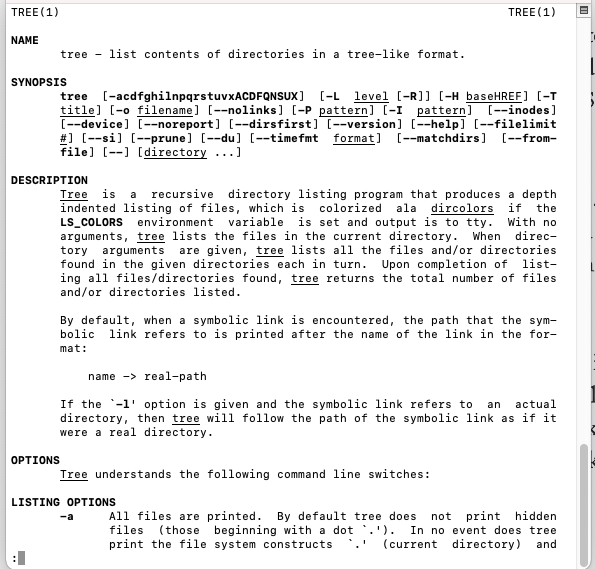
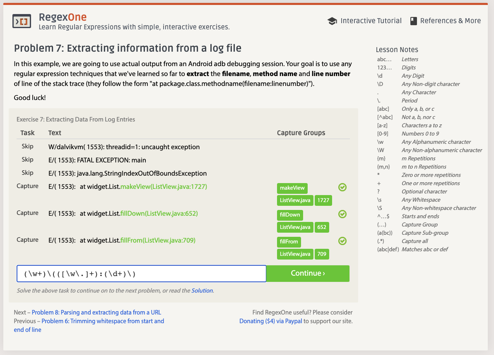
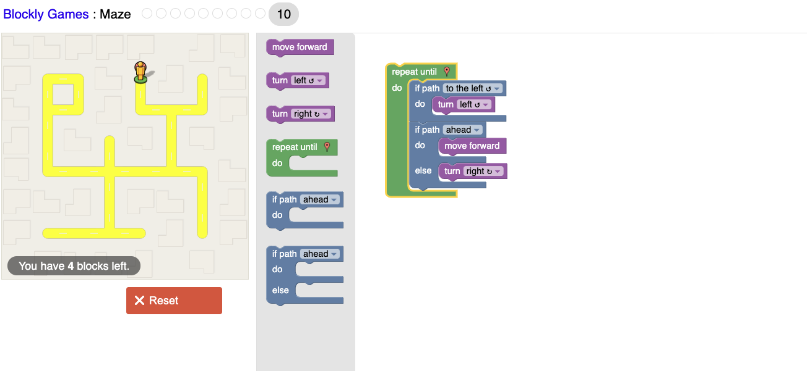

# Lab 01 Report - Introduction to Open Source Software

## Discord Message

---
## Reading Assignments

### Suggestions: How To Answer Questions in a Helpful Way
0. It is a lot more informative when an answer describes context about the thought process and decisions it took to reach the answer. Answers like that have helped me greatly improve my debugging and problem-solving skills.

1. If it is relevant, try and include other ways to go about solving the same problem.

### Free Culture Chapter 3 Response

Chapter 3 of 'Free Culture' highlights some of the differences between how software was treated in 2002 compared to how it's treated today. Nowadays, it's very unlikely RPI would ever even allow for a student-run "intranet" file search engine. Software has matured over the last two decades, and as a result, there are now many regulations in place that make such a tool very difficult to operate without the risk of serious legal repercussions--even if it were created with good intent. Simply put, there's far too much of a risk on RPI's behalf of the tool being used for malicious intent. Chapter 3 also shines light on some of the many issues that still plague software today. One of the many issues is how massive organizations like the RIAA still have power over small groups of developers. Adding on, it also shows yet another example of how ruthless large corporations are when it comes to having a say over the technology developers want to innovate. Unfortunately, money will be the ultimate source of power no matter how prominent software is in our society.

---
## `Man Tree` Command

---
## Regex

### Practice Problems
(Just including last picture as Prof. Turner said it was acceptable)

### Regex Crosswords

---
## Blockly Practice

---
## Open Source Project Evaluation

The open source framework I have selected is called Gluon Maps, which can be found at the following GitHub repository: https://github.com/gluonhq/maps. Gluon Maps is a Java library that allows for an easy way to integrate maps into any Java application using JavaFX. The feature/project I have in mind to add is tile layers support for Google Maps. Gluon Maps is a map engine meant to render tiles from various providers, so implementing Google Maps tile layers would add yet another tile provider to render. From the stakeholders’ perspective, this is desirable as it would greatly improve the flexibility and usability of Gluon Maps. It would also open up Gluon Maps to a whole new slew of features included with Google Maps tiles. This feature was discussed and approved by Eugene Ryzhikov, Gluon's co-founder and chief technical officer.