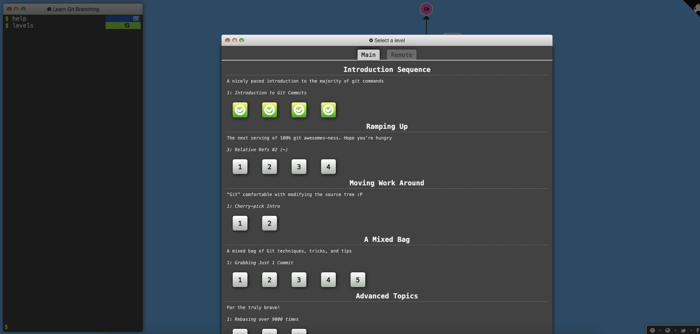

# Lab 02 Report - Git

## Part 1
[Part 1 Repository Link](https://github.com/Colton-Zecca/oss-lab-2-part-1)

### Screenshots
`gitk`:

`gitk --all`:

`git log --graph --oneline --decorate`:

## Part 2
[Part 2 Repository Link](https://github.com/Colton-Zecca/Spoon-Knife)

### Screenshots
Learn Git Branching Work:

## Part 3
[Link to Fork of PullReq](https://github.com/Colton-Zecca/PullReq)

### Screenshots
`git diff HEAD~1` (Diff between my fork of PullReq and the 1st parent of where HEAD points):

`git tag -l` output for PullReq Repository:

### OSSProjectIdeas

[Link to Fork of OSSProjectIdeas](https://github.com/Colton-Zecca/OSSProjectIdeas)
