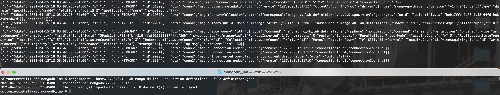
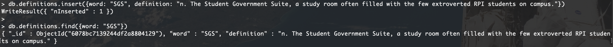
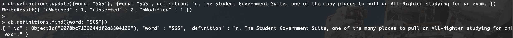
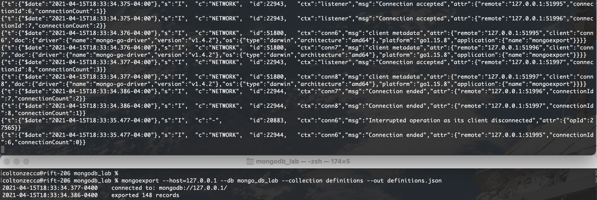
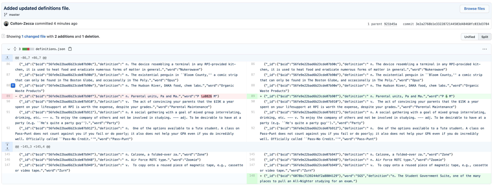
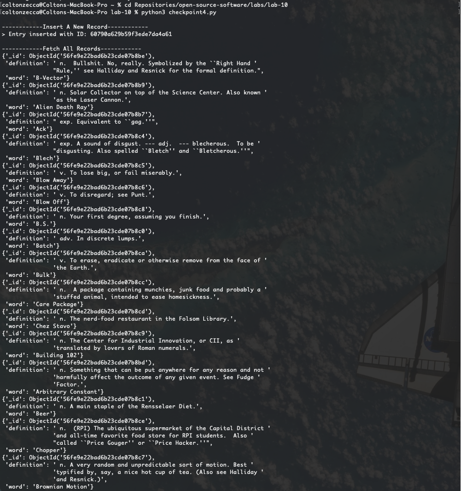
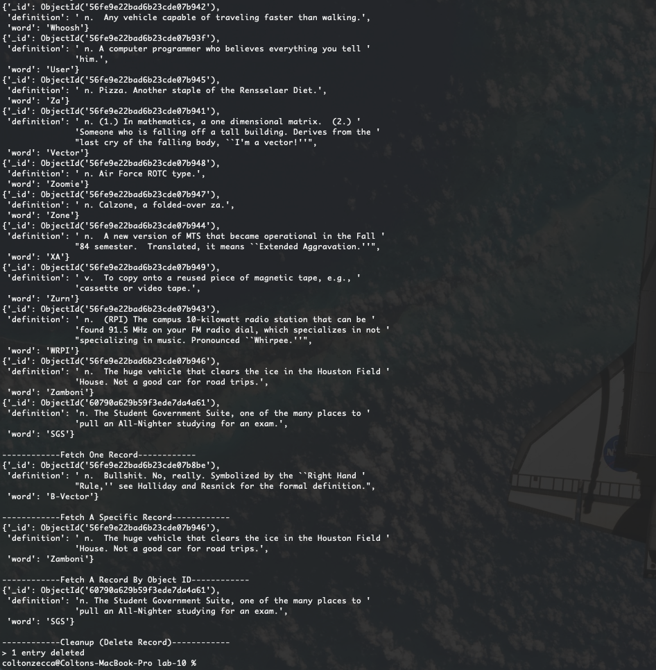
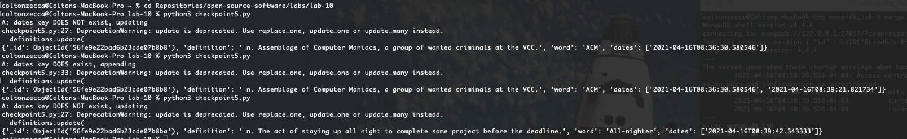
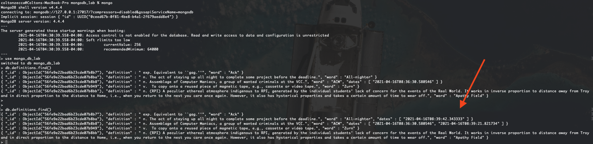

# Lab 10 Report - MongoDB

## Checkpoint 0: Project Updates
[Blog Post:](https://github.com/Colton-Zecca/open-source-software/wiki/Did-MongoDB-have-every-right-to-change-their-license,-or-were-they-usurping-developer's-rights%3F) _Did MongoDB have every right to change their license, or were they usurping developer's rights?_

---
## Checkpoint 1: Install MongoDB

### Connection Accepted Message

---
## Checkpoint 2: Load Some Data

### Output for createCollection

---
## Checkpoint 3: Basic Queries

### Record Entered

### Record Updated

### `mongoexport` Command

### Git Diff After `mongoexport` With New Record

---
## Checkpoint 4: Driving Queries

[Checkpoint 4 Script](./checkpoint4.py)

__Checkpoint 4 Output:__

_Skipping over records in between..._

---
## Checkpoint 5: Random Word Requester

[Checkpoint 5 Script](./checkpoint5.py)

### Running `checkpoint5.py`
Note the "A" debug print statement, that shows whether or not a date is found and whether or not we're appending to "dates" or creating the initial "dates" array.

### Calling `find()` in `mongo`
Note that I only input 5 definitions. After running the python script a couple times as shown in the screenshot above, we can see here that the word "ACM" was randomly hit one by the python script (since there's one entry in "dates"). We can also see how the word "ACM" was hit twice by our python script, so it concatenated the second date onto the end of that "dates" array. The other 3 words didn't get hit by my python script. Each test case is shown! On the first try, too! Ok, time to get sleep now.

---
## Licensing
See main LICENSE used for this repository.