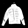
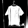
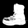
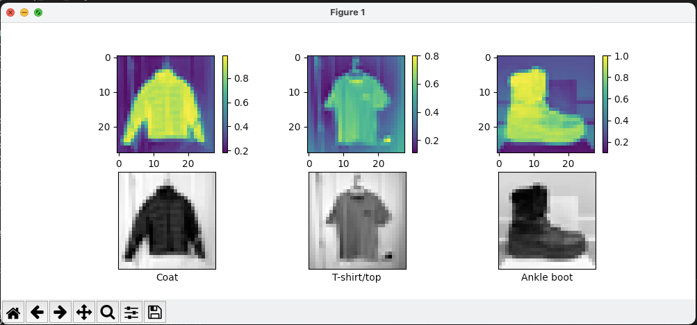
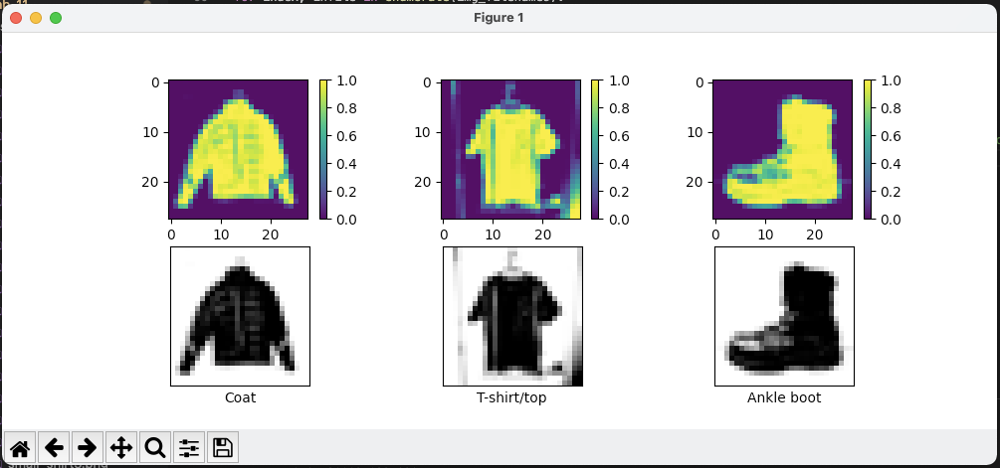
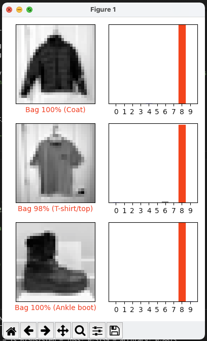
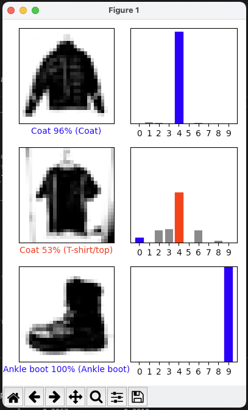

# Lab 11 Report - TensorFlow

## Checkpoint 1: Verify Your TensorFlow


---
## Checkpoint 2: Run a TensorFlow Classification


---
## Checkpoint 3: Curate Some Data


### Test Image 0
__Original Image:__


__Greyscale 28x28 Pixel Image:__


__Greyscale 28x28 Pixel Image After Improving Image Processing:__


__Result of Classification:__
```
my_image_predictions[0]: [4.07006883e-06 1.41815035e-05 4.80614744e-06 1.14597842e-05 1.23828531e-05 1.78439620e-07 3.12578893e-04 7.88929988e-09 9.99639869e-01 4.29125748e-07]
 > Predicted: 8 Bag
 > Actual: 4 Coat 
 ```

__Result of Classification After Improving Image Processing:__
```
my_image_predictions[0]: [1.4969037e-04 1.4901966e-02 7.6033841e-03 3.4572061e-03 9.5958668e-01 3.1906429e-03 7.1103298e-03 5.0875387e-06 3.9936150e-03 1.2943780e-06]
> Predicted: 4 Coat
> Actual: 4 Coat
```


### Test Image 1
__Original Image:__


__Greyscale 28x28 Pixel Image:__


__Greyscale 28x28 Pixel Image After Improving Image Processing:__


__Result of Classification:__
```
my_image_predictions[1]: [7.5068124e-06 8.3200328e-05 7.6288132e-05 6.2201769e-05 2.4235405e-05 3.1269722e-06 6.0978933e-04 2.8550282e-06 9.9898309e-01 1.4763392e-04]
> Predicted: 8 Bag
> Actual: 0 T-shirt/top
```

__Result of Classification After Improving Image Processing:__
```
my_image_predictions[1]: [5.2913584e-02 6.6143303e-04 1.2702127e-01 1.4350459e-01 5.2585542e-01 6.3795624e-06 1.2745397e-01 8.8833267e-06 2.2568980e-02 5.5101414e-06]
> Predicted: 4 Coat
> Actual: 0 T-shirt/top
```


### Test Image 2
__Original Image:__


__Greyscale 28x28 Pixel Image:__


__Greyscale 28x28 Pixel Image After Improving Image Processing:__


__Result of Classification:__
```
my_image_predictions[2]: [2.9838379e-10 3.2054711e-08 6.8288393e-09 2.9382446e-10 7.5506190e-10 8.2339977e-12 3.8126421e-07 3.7014687e-13 9.9999952e-01 1.5916639e-12]
> Predicted: 8 Bag
> Actual: 9 Ankle boot
```

__Result of Classification After Improving Image Processing:__
```
my_image_predictions[2]: [3.1012082e-08 2.6144582e-09 3.4029139e-08 6.8078654e-09 1.0183211e-09 1.5527270e-04 9.1015895e-10 2.0965447e-03 2.4464878e-11 9.9774808e-01]
> Predicted: 9 Ankle boot
> Actual: 9 Ankle boot
```


### Notes on Predictions
Due to issues with noise in the images, I was unable to get it to recognize the correct image despite doing all of the proper image handling. In the essence of time, I'm going to submit what I have now to show that I have working code and make some commits after to try and get rid of some of the noise in my images. If I get the image formatting to properly work with my custom images, I'll add them to this lab and make note that it was added after the midnight deadline for personal sake. 

| Before Improving Image Processing | After Improving Image Processing |
| --- | --- |
|  |  |
|  |  | 

---
## Licensing
The code for checkpoint2.py uses the MIT license.