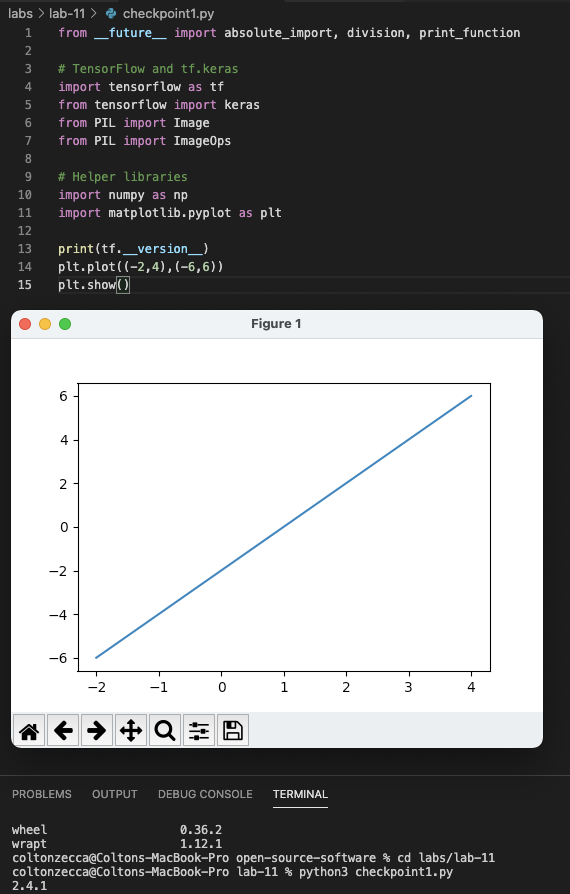
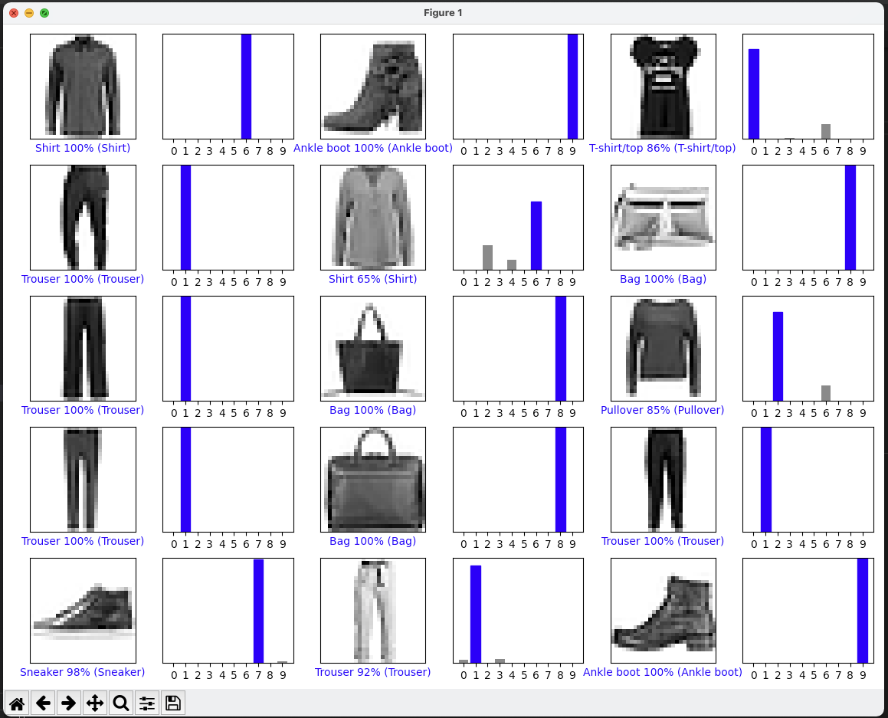
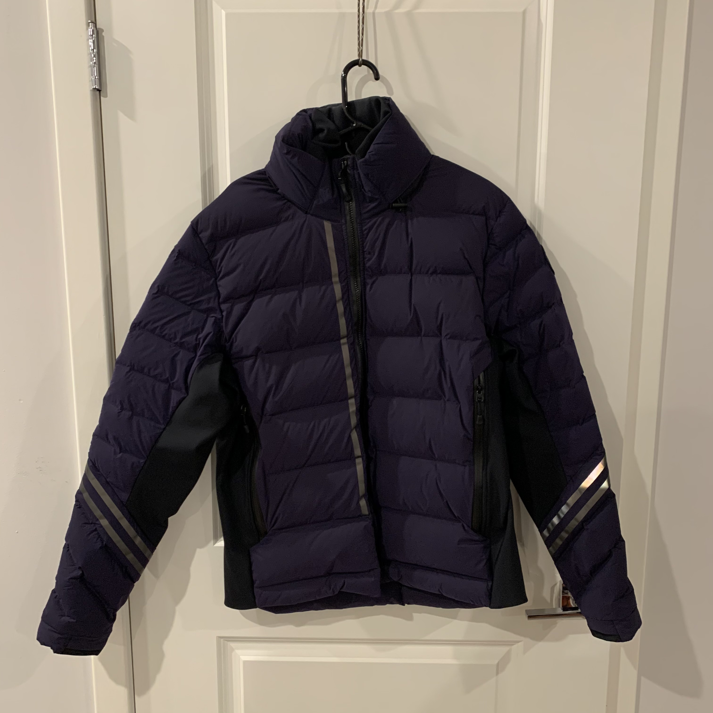
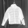
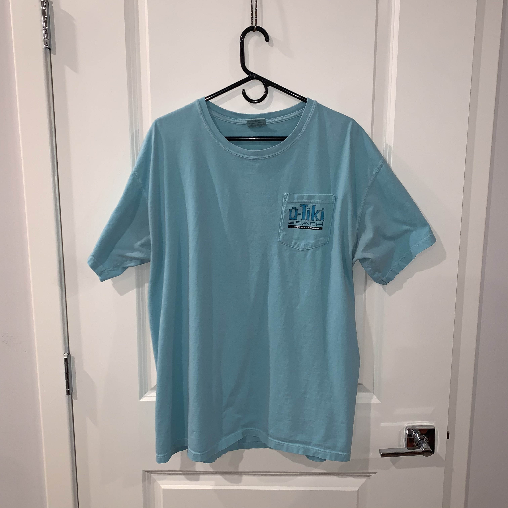
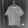
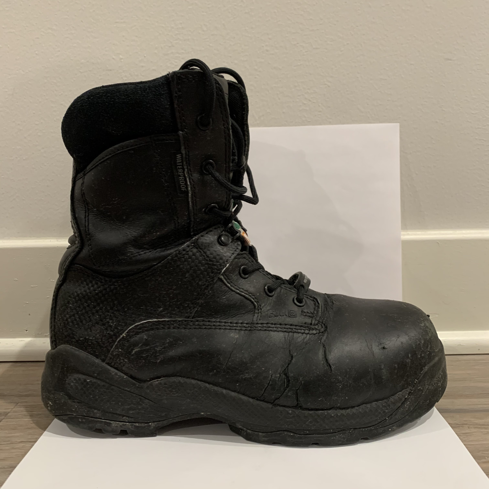
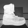

# Lab 11 Report - TensorFlow

## Checkpoint 1: Verify Your TensorFlow

---
## Checkpoint 2: Run a TensorFlow Classification

---
## Checkpoint 3: Curate Some Data

### Test Image 0
__Original Image:__

__Greyscale 28x28 Pixel Image:__

__Result of Classification:__

### Test Image 1
__Original Image:__

__Greyscale 28x28 Pixel Image:__

__Result of Classification:__

### Test Image 2
__Original Image:__

__Greyscale 28x28 Pixel Image:__

__Result of Classification:__

---
## Licensing
The code for checkpoint2.py uses the MIT license.