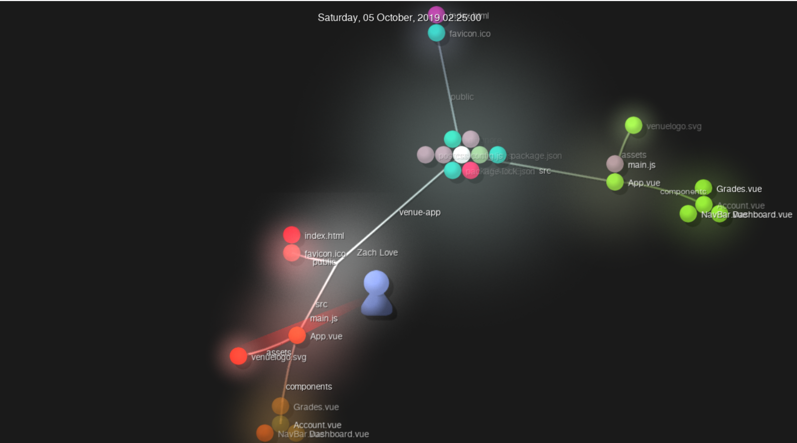

# Lab 3 Report - Documentation and Community

## Part 1 - Documentation

[Wiki Page for Project](https://github.com/Colton-Zecca/open-source-software/wiki/Lab-3-Part-1)

[LatEx Problems PDF](Lab3Part1.pdf)

[LatEx Problems Raw .tex File](Lab3Part1.tex)

---
## Part 2 - Community

### OpenCircuits 
- __Number of Contributors:__ 33
- __Number of Lines of Code:__ 26796
- __First Commit:__ https://github.com/OpenCircuits/OpenCircuits/commit/c4a9e7d66d32391f9371a68a0749588a6218b5b3
- __Latest Commit:__ https://github.com/OpenCircuits/OpenCircuits/commit/33296784ecf4fabf6b2439e04540049b15fcb26a
- __Current Branches:__ 
    - origin/AnalogWork
    - origin/Browser-compatibility-(version,-etc.)
    - origin/Documentation
    - origin/HEAD -> origin/master
    - origin/ICLibrary
    - origin/MUXLabel
    - origin/MainTutorial
    - origin/Optimizations
    - origin/PlaceComponentFix
    - origin/Replace_Component
    - origin/SelectionToolTest
    - origin/Snap_Options
    - origin/TashBranch
    - origin/UnitTests
    - origin/VideoTutorialPage
    - origin/all
    - origin/db-versioning
    - origin/expression-to-circuit
    - origin/master
    - origin/port-8081
- __GitStats Number of Lines of Code:__ 26335
- __GitStats Number of Contributors:__ 41

### SMAB
- __Number of Contributors:__ 2
- __Number of Lines of Code:__ 1606
- __First Commit:__ https://github.com/SeanMiller969/SMAB/commit/d6eb67161dade78a5237a4b6cf7a109fedb74387
- __Latest Commit:__ https://github.com/SeanMiller969/SMAB/commit/f099ec61dc7a58080079a32e48e05a8d96bae991
- __Current Branches:__ 
    - master
    - URLtraverseandJSON
    - User-Interface
    - Class-Files
    - rmupdate
- __GitStats Number of Contributors:__ 4
- __GitStats Number of Lines of Code:__ 1590

### ShuttleTracker
- __Number of Contributors:__ 33 
- __Number of Lines of Code:__ 62080
- __First Commit:__ https://github.com/wtg/shuttletracker/commit/3453b12cb6d53080a0967644eddf44111fef0c54
- __Latest Commit:__ https://github.com/wtg/shuttletracker/commit/b98b319901c248df6b1daffe7782041914411b46
- __Current Branches (Active):__
    - eta_refactored
    - smooth-tracking-algorithm-2
    - smooth-tracking-predict-light-stops
    - update-headings
    - shuttle-slide
    - smooth-tracking
    - feedback2
    - update_Package
    - smooth-tracking-predict-turns
- __GitStats Number of Contributors:__ 39
- __GitStats Number of Lines of Code:__ 52719

### RPI CampusMap
- __Number of Contributors:__ 12
- __Number of Lines of Code:__ 37207
- __First Commit:__ https://github.com/gaskij/rpicampusmap/commit/5addd28
- __Latest Commit:__ https://github.com/gaskij/rpicampusmap/commit/2b735c7
- __Current Branches:__
    - master
    - readmeupdate
    - bugfix/update-leaflet
    - docs/cas
    - feature/auth-context
    - feature/login_page
    - dev
    - live_location_tracking
    - feature_prof_search
    - legacy
    - feature/comment-api
- __GitStats Number of Contributors:__ 18
- __GitStats Number of Lines of Code:__ 21118

### Venue
- __Number of Contributors:__ 16
- __Number of Lines of Code:__ 562692
- __First Commit:__ https://github.com/rcos/Venue2/commit/59b0b87b05395211b2d69de63f5c7664594ec17b
- __Latest Commit:__ https://github.com/rcos/Venue2/commit/72f0929bc9584b08c2e9e036b58e0c7f4117d631
- __Current Branches:__ 
    - dependabot/npm_and_yarn/axios-0.21.1 
    - dependabot/npm_and_yarn/server/date-and-time-0.14.2 
    - course_overview 
    - snooze 
    - agreement 
    - notification 
    - engagements 
    - multiselect 
    - SVG-Icons 
    - minn_fixes 
    - better-dashboard 
    - organizations 
    - stats 
    - uml 
    - new_course_fix 
    - ethanfixes 
    - dark_mode 
    - drop_down_modulation 
    - course_settings 
    - clipboard
- __GitStats Number of Contributors:__ 25
- __GitStats Number of Lines of Code:__ 61159
- __Gource Screenshot for Venue__: 

---
## Team Members' Repositories:
- https://github.com/tsanford13/OSS-Labs/blob/master/labs/lab3/lab3.md
- https://github.com/TGCrystal/oss-labs/blob/master/labs/lab-03/report.md
- https://github.com/gabeorlanski/oss-repo-template/blob/master/labs/lab-03/Lab3.md
- https://github.com/christinekoul/oss-repo/blob/master/labs/lab-03/lab3.md
- https://github.com/kevinb5617/oss-kb/blob/master/labs/lab-03/Lab3.md