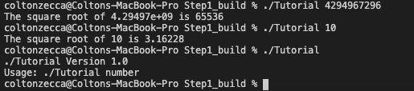
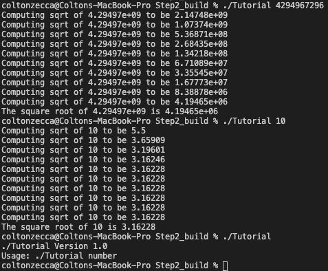
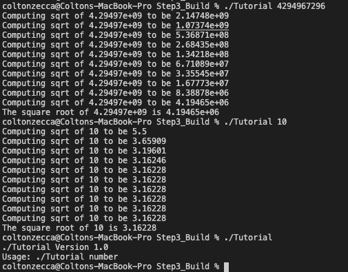
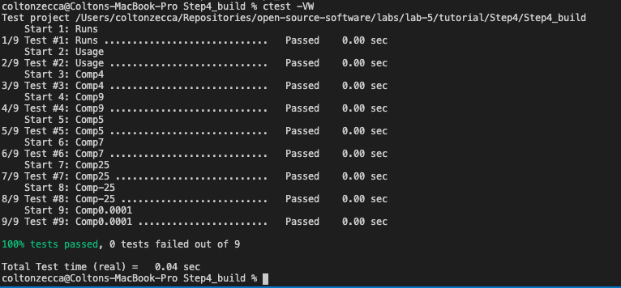
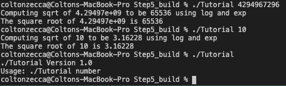

# Lab 5 Report - Build Systems

## Part 1 - CMake Tutorial

### Step 1
Include modified code, tutorial.cxx, the CMakeLists.txt along w/ a ss of running the Tutorial code without input, with 10 and with 4294967296.

### Step 2
Include modified code, tutorial.cxx, the CMakeLists.txt along w/ a ss of running the Tutorial code without input, with 10 and with 4294967296.

### Step 3
Include CMakeLists.txt and MathFunctions/CMakeLists.txt (most of your changes for Step3 will be in MathFunctions/CMakeLists.txt) along with a screen shot of running the Tutorial code without input, with 10 and with 4294967296

### Step 4
Include CMakeLists.txt and MathFunctions/CMakeLists.txt along with the output of running ctest -VV

### Step 5
Include CMakeLists.txt and MathFunctions/CMakeLists.txt along with a screen shot of running the Tutorial for the USE_MYMATH case code without input, with 10 and with 4294967296.

## Part 2 - Build Systems Example

## License

The started code used for the tutorial within the 'tutorial' folder is taken from the CMake repository, which uses the OSI-approved BSD 3-clause license. This code is just used for personal educational use. See CMake's [license](https://gitlab.kitware.com/cmake/cmake/-/blob/11506eb1297ee50a213bad6beb943ba41556c58e/Copyright.txt) for more details.