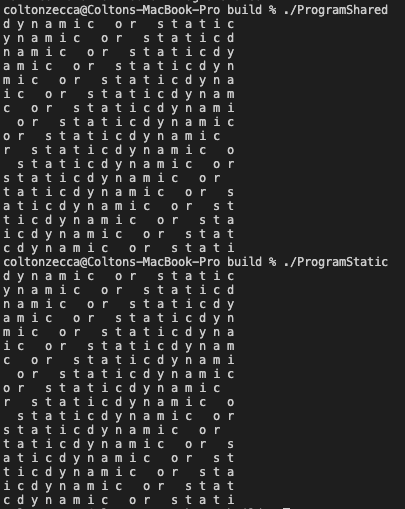

# Lab 5 Report - Build Systems

## Part 1 - CMake Tutorial

### Step 1
[Step 1 Code](https://github.com/Colton-Zecca/open-source-software/tree/master/labs/lab-5/tutorial/Step1)


### Step 2
[Step 2 Code](https://github.com/Colton-Zecca/open-source-software/tree/master/labs/lab-5/tutorial/Step2)


### Step 3
[Step 3 Code](https://github.com/Colton-Zecca/open-source-software/tree/master/labs/lab-5/tutorial/Step3)


### Step 4
[Step 4 Code](https://github.com/Colton-Zecca/open-source-software/tree/master/labs/lab-5/tutorial/Step4)


### Step 5
[Step 5 Code](https://github.com/Colton-Zecca/open-source-software/tree/master/labs/lab-5/tutorial/Step5)


## Part 2 - Build Systems Example

### Makefile
```
all: programStatic programShared

programStatic: program.c static_block.a Makefile
			gcc program.c static_block.a -o programStatic

programShared: program.c shared_block.so Makefile
			gcc program.c shared_block.so -o programShared -Wl, -rpath .

static_block.a: block.o Makefile 
			ar qc static_block.a block.o

shared_block.so: block.o Makefile 
			gcc -shared -o shared_block.so block.o

block.o: source/block.c Makefile
		gcc -fPIC -c source/block.c -o block.o

.PHONY: clean
clean:	
	rm -rf *.o *.a *.so programShared programStatic
```

### CMakeLists.txt
```
cmake_minimum_required(VERSION 3.10)

project(ProgramStatic)
add_library(static_block.a source/block.c)
add_executable(ProgramStatic program.c)
target_link_libraries(ProgramStatic static_block.a)


project(ProgramShared)
add_library(shared_block.so SHARED source/block.c)
add_executable(ProgramShared program.c)
target_link_libraries(ProgramShared shared_block.so)
```

### Makefile Generated by cmake
```
# CMAKE generated file: DO NOT EDIT!
# Generated by "Unix Makefiles" Generator, CMake Version 3.20

# Default target executed when no arguments are given to make.
default_target: all
.PHONY : default_target

# Allow only one "make -f Makefile2" at a time, but pass parallelism.
.NOTPARALLEL:

#=============================================================================
# Special targets provided by cmake.

# Disable implicit rules so canonical targets will work.
.SUFFIXES:

# Disable VCS-based implicit rules.
% : %,v

# Disable VCS-based implicit rules.
% : RCS/%

# Disable VCS-based implicit rules.
% : RCS/%,v

# Disable VCS-based implicit rules.
% : SCCS/s.%

# Disable VCS-based implicit rules.
% : s.%

.SUFFIXES: .hpux_make_needs_suffix_list

# Command-line flag to silence nested $(MAKE).
$(VERBOSE)MAKESILENT = -s

#Suppress display of executed commands.
$(VERBOSE).SILENT:

# A target that is always out of date.
cmake_force:
.PHONY : cmake_force

#=============================================================================
# Set environment variables for the build.

# The shell in which to execute make rules.
SHELL = /bin/sh

# The CMake executable.
CMAKE_COMMAND = /Applications/CMake.app/Contents/bin/cmake

# The command to remove a file.
RM = /Applications/CMake.app/Contents/bin/cmake -E rm -f

# Escaping for special characters.
EQUALS = =

# The top-level source directory on which CMake was run.
CMAKE_SOURCE_DIR = /Users/coltonzecca/Repositories/open-source-software/labs/lab-5/Lab-BuildSystemsPart2

# The top-level build directory on which CMake was run.
CMAKE_BINARY_DIR = /Users/coltonzecca/Repositories/open-source-software/labs/lab-5/Lab-BuildSystemsPart2/build

#=============================================================================
# Targets provided globally by CMake.

# Special rule for the target rebuild_cache
rebuild_cache:
	@$(CMAKE_COMMAND) -E cmake_echo_color --switch=$(COLOR) --cyan "Running CMake to regenerate build system..."
	/Applications/CMake.app/Contents/bin/cmake --regenerate-during-build -S$(CMAKE_SOURCE_DIR) -B$(CMAKE_BINARY_DIR)
.PHONY : rebuild_cache

# Special rule for the target rebuild_cache
rebuild_cache/fast: rebuild_cache
.PHONY : rebuild_cache/fast

# Special rule for the target edit_cache
edit_cache:
	@$(CMAKE_COMMAND) -E cmake_echo_color --switch=$(COLOR) --cyan "Running CMake cache editor..."
	/Applications/CMake.app/Contents/bin/ccmake -S$(CMAKE_SOURCE_DIR) -B$(CMAKE_BINARY_DIR)
.PHONY : edit_cache

# Special rule for the target edit_cache
edit_cache/fast: edit_cache
.PHONY : edit_cache/fast

# The main all target
all: cmake_check_build_system
	$(CMAKE_COMMAND) -E cmake_progress_start /Users/coltonzecca/Repositories/open-source-software/labs/lab-5/Lab-BuildSystemsPart2/build/CMakeFiles /Users/coltonzecca/Repositories/open-source-software/labs/lab-5/Lab-BuildSystemsPart2/build//CMakeFiles/progress.marks
	$(MAKE) $(MAKESILENT) -f CMakeFiles/Makefile2 all
	$(CMAKE_COMMAND) -E cmake_progress_start /Users/coltonzecca/Repositories/open-source-software/labs/lab-5/Lab-BuildSystemsPart2/build/CMakeFiles 0
.PHONY : all

# The main clean target
clean:
	$(MAKE) $(MAKESILENT) -f CMakeFiles/Makefile2 clean
.PHONY : clean

# The main clean target
clean/fast: clean
.PHONY : clean/fast

# Prepare targets for installation.
preinstall: all
	$(MAKE) $(MAKESILENT) -f CMakeFiles/Makefile2 preinstall
.PHONY : preinstall

# Prepare targets for installation.
preinstall/fast:
	$(MAKE) $(MAKESILENT) -f CMakeFiles/Makefile2 preinstall
.PHONY : preinstall/fast

# clear depends
depend:
	$(CMAKE_COMMAND) -S$(CMAKE_SOURCE_DIR) -B$(CMAKE_BINARY_DIR) --check-build-system CMakeFiles/Makefile.cmake 1
.PHONY : depend

#=============================================================================
# Target rules for targets named ProgramStatic

# Build rule for target.
ProgramStatic: cmake_check_build_system
	$(MAKE) $(MAKESILENT) -f CMakeFiles/Makefile2 ProgramStatic
.PHONY : ProgramStatic

# fast build rule for target.
ProgramStatic/fast:
	$(MAKE) $(MAKESILENT) -f CMakeFiles/ProgramStatic.dir/build.make CMakeFiles/ProgramStatic.dir/build
.PHONY : ProgramStatic/fast

#=============================================================================
# Target rules for targets named ProgramShared

# Build rule for target.
ProgramShared: cmake_check_build_system
	$(MAKE) $(MAKESILENT) -f CMakeFiles/Makefile2 ProgramShared
.PHONY : ProgramShared

# fast build rule for target.
ProgramShared/fast:
	$(MAKE) $(MAKESILENT) -f CMakeFiles/ProgramShared.dir/build.make CMakeFiles/ProgramShared.dir/build
.PHONY : ProgramShared/fast

#=============================================================================
# Target rules for targets named shared_block.so

# Build rule for target.
shared_block.so: cmake_check_build_system
	$(MAKE) $(MAKESILENT) -f CMakeFiles/Makefile2 shared_block.so
.PHONY : shared_block.so

# fast build rule for target.
shared_block.so/fast:
	$(MAKE) $(MAKESILENT) -f CMakeFiles/shared_block.so.dir/build.make CMakeFiles/shared_block.so.dir/build
.PHONY : shared_block.so/fast

#=============================================================================
# Target rules for targets named static_block.a

# Build rule for target.
static_block.a: cmake_check_build_system
	$(MAKE) $(MAKESILENT) -f CMakeFiles/Makefile2 static_block.a
.PHONY : static_block.a

# fast build rule for target.
static_block.a/fast:
	$(MAKE) $(MAKESILENT) -f CMakeFiles/static_block.a.dir/build.make CMakeFiles/static_block.a.dir/build
.PHONY : static_block.a/fast

program.o: program.c.o
.PHONY : program.o

# target to build an object file
program.c.o:
	$(MAKE) $(MAKESILENT) -f CMakeFiles/ProgramStatic.dir/build.make CMakeFiles/ProgramStatic.dir/program.c.o
	$(MAKE) $(MAKESILENT) -f CMakeFiles/ProgramShared.dir/build.make CMakeFiles/ProgramShared.dir/program.c.o
.PHONY : program.c.o

program.i: program.c.i
.PHONY : program.i

# target to preprocess a source file
program.c.i:
	$(MAKE) $(MAKESILENT) -f CMakeFiles/ProgramStatic.dir/build.make CMakeFiles/ProgramStatic.dir/program.c.i
	$(MAKE) $(MAKESILENT) -f CMakeFiles/ProgramShared.dir/build.make CMakeFiles/ProgramShared.dir/program.c.i
.PHONY : program.c.i

program.s: program.c.s
.PHONY : program.s

# target to generate assembly for a file
program.c.s:
	$(MAKE) $(MAKESILENT) -f CMakeFiles/ProgramStatic.dir/build.make CMakeFiles/ProgramStatic.dir/program.c.s
	$(MAKE) $(MAKESILENT) -f CMakeFiles/ProgramShared.dir/build.make CMakeFiles/ProgramShared.dir/program.c.s
.PHONY : program.c.s

source/block.o: source/block.c.o
.PHONY : source/block.o

# target to build an object file
source/block.c.o:
	$(MAKE) $(MAKESILENT) -f CMakeFiles/shared_block.so.dir/build.make CMakeFiles/shared_block.so.dir/source/block.c.o
	$(MAKE) $(MAKESILENT) -f CMakeFiles/static_block.a.dir/build.make CMakeFiles/static_block.a.dir/source/block.c.o
.PHONY : source/block.c.o

source/block.i: source/block.c.i
.PHONY : source/block.i

# target to preprocess a source file
source/block.c.i:
	$(MAKE) $(MAKESILENT) -f CMakeFiles/shared_block.so.dir/build.make CMakeFiles/shared_block.so.dir/source/block.c.i
	$(MAKE) $(MAKESILENT) -f CMakeFiles/static_block.a.dir/build.make CMakeFiles/static_block.a.dir/source/block.c.i
.PHONY : source/block.c.i

source/block.s: source/block.c.s
.PHONY : source/block.s

# target to generate assembly for a file
source/block.c.s:
	$(MAKE) $(MAKESILENT) -f CMakeFiles/shared_block.so.dir/build.make CMakeFiles/shared_block.so.dir/source/block.c.s
	$(MAKE) $(MAKESILENT) -f CMakeFiles/static_block.a.dir/build.make CMakeFiles/static_block.a.dir/source/block.c.s
.PHONY : source/block.c.s

# Help Target
help:
	@echo "The following are some of the valid targets for this Makefile:"
	@echo "... all (the default if no target is provided)"
	@echo "... clean"
	@echo "... depend"
	@echo "... edit_cache"
	@echo "... rebuild_cache"
	@echo "... ProgramShared"
	@echo "... ProgramStatic"
	@echo "... shared_block.so"
	@echo "... static_block.a"
	@echo "... program.o"
	@echo "... program.i"
	@echo "... program.s"
	@echo "... source/block.o"
	@echo "... source/block.i"
	@echo "... source/block.s"
.PHONY : help


#=============================================================================
# Special targets to cleanup operation of make.

# Special rule to run CMake to check the build system integrity.
# No rule that depends on this can have commands that come from listfiles
# because they might be regenerated.
cmake_check_build_system:
	$(CMAKE_COMMAND) -S$(CMAKE_SOURCE_DIR) -B$(CMAKE_BINARY_DIR) --check-build-system CMakeFiles/Makefile.cmake 0
.PHONY : cmake_check_build_system
```

### Program Size of Shared and Static Versions from Custom Makefile
```
-rwxr-xr-x   1 coltonzecca  staff  49440 Mar  1 23:39 programShared
-rwxr-xr-x   1 coltonzecca  staff  49520 Mar  1 23:39 programStatic
```

### Program Size of Shared and Static Versions from CMakeLists Program Size
```
-rwxr-xr-x   1 coltonzecca  staff  49440 Mar  1 23:36 ProgramShared
-rwxr-xr-x   1 coltonzecca  staff  49520 Mar  1 23:36 ProgramStatic
```

### Results of Running the Program


## License
The started code used for the tutorial within the 'tutorial' folder is taken from the CMake repository, which uses the OSI-approved BSD 3-clause license. This code is just used for personal educational use. See CMake's [license](https://gitlab.kitware.com/cmake/cmake/-/blob/11506eb1297ee50a213bad6beb943ba41556c58e/Copyright.txt) for more details.