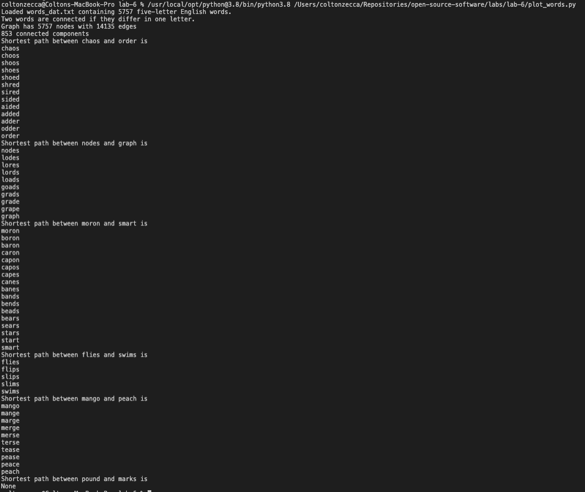
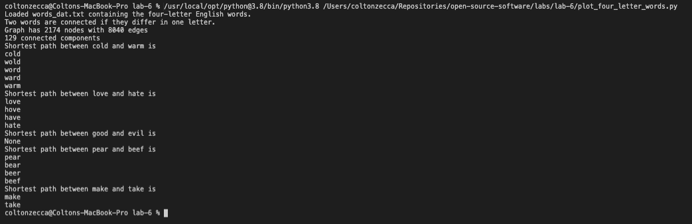
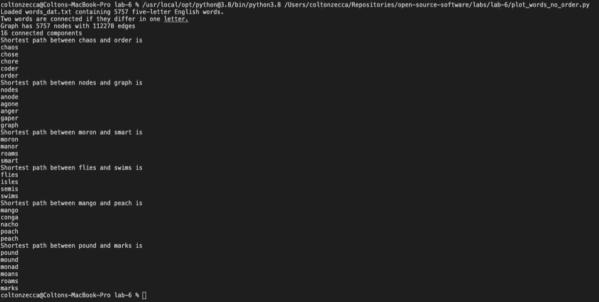

# Lab 6 Report - Scientific Computation

## Part 1 - Five Letter Words
[Part 1 Code](https://github.com/Colton-Zecca/open-source-software/blob/master/labs/lab-6/plot_words.py)

### Part 2 - Four Letter Words
[Part 2 Code](https://github.com/Colton-Zecca/open-source-software/blob/master/labs/lab-6/plot_four_letter_words.py)

### Part 3 - Unordered Solution
[Part 3 Code](https://github.com/Colton-Zecca/open-source-software/blob/master/labs/lab-6/plot_words_no_order.py)

