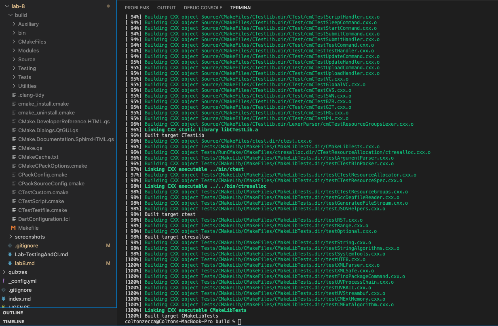
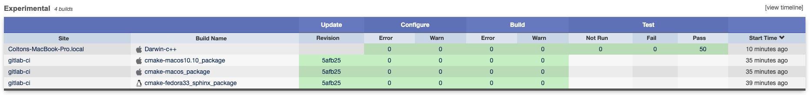
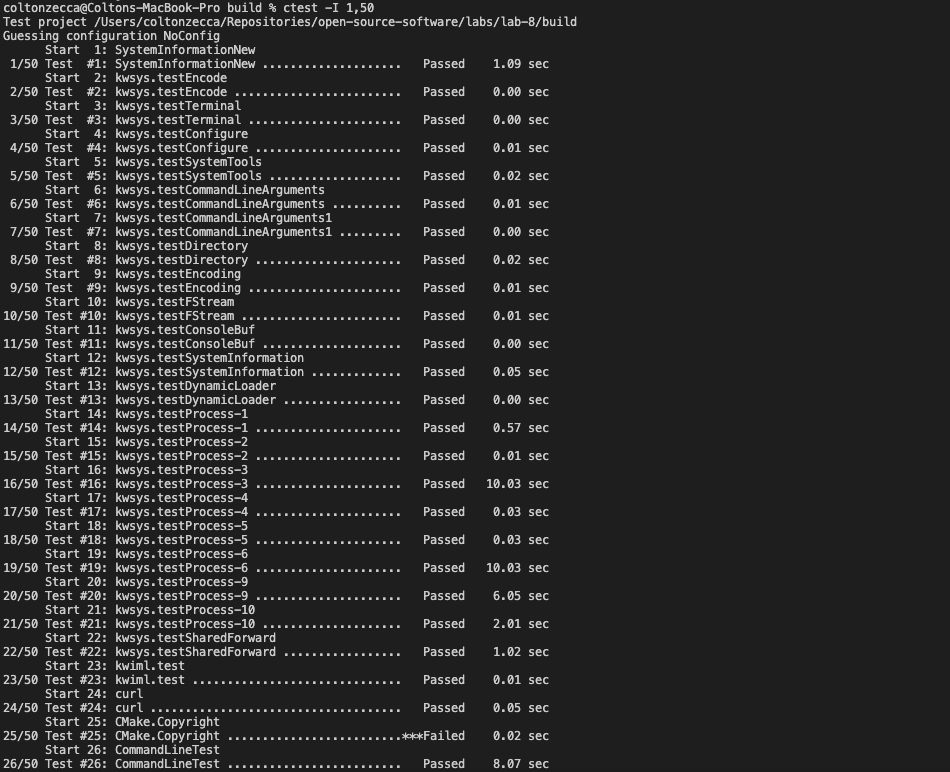
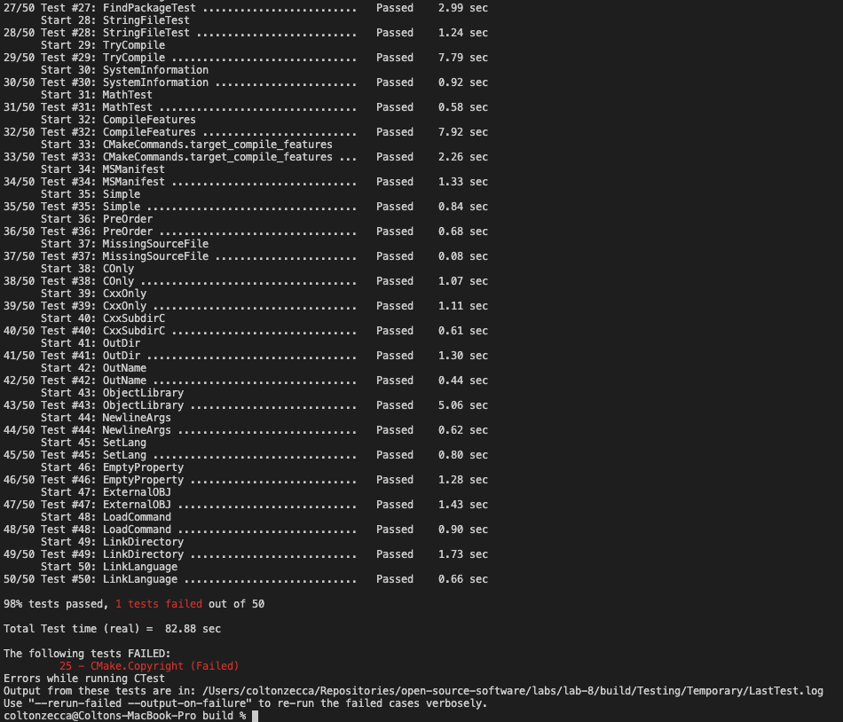
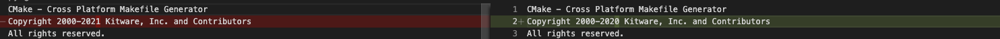
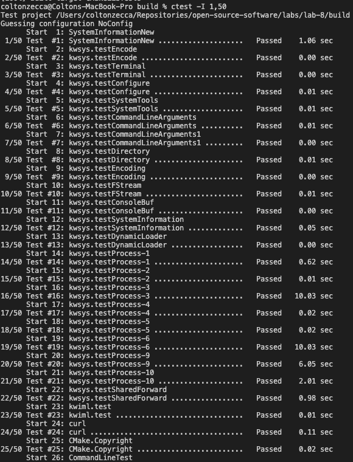
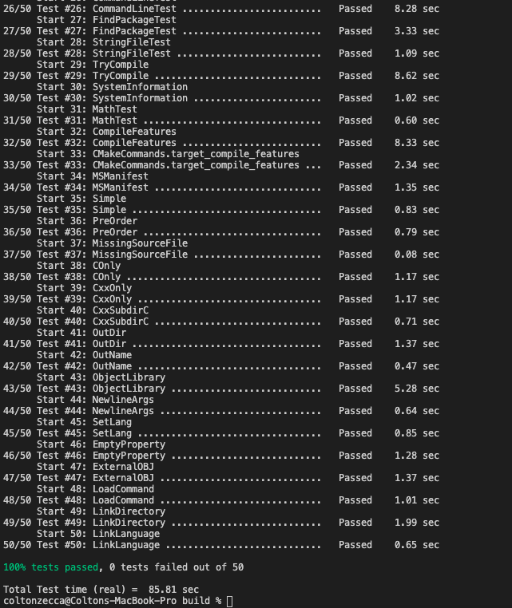

# Lab 8 Report - Testing and Continuous Integration

## Checkpoint 1 - Getting Started

## Checkpoint 2 - Executing The Tests
__Find the Nightly and Experimental sections and look at some of the submissions. How can you see what tests were run for a particular submission?__

By clicking the build name and clicking on the "View Tests Summary" link at the bottom of the page.

__Find a submission with errors. Can you see what the error condition was? How does this help you debug the failure?__

See [this build with a failing test](https://open.cdash.org/viewTest.php?buildid=7139213). The error condition is the cmake project configuration not allocating the proper amount of resources. It helps me debug my failure because I can see the actual output, expected output, and call stack of where the error occurred.

__Find a system that is close to your specific configuration in the Nightly, Nightly Expected or one of the Masters sections. How clean is the dashboard? Are there any errors that you need to be concerned with?__

[This build](https://open.cdash.org/build/7139212) is a Nightly Expected build for a system that's similar to my specific configuration. The dashboard is clean, and there are both 0 errors and warnings across the board. 

__Go back to the dashboard and find your submission. Are there any errors? If so, are they consistent with other projects using your architecture?__

There are no errors, see below for links and screenshot:

[Link to my build](https://open.cdash.org/build/7139394)

## Checkpoint 3 - Failing/Passing a Test

__What information does the failure provide?__
The failure provides which test failed, the time it took the test to execute, and a message that shows the user where to find the output for the tests. 

### Output with Errors:

### Screenshot of the Fix:
This screenshot shows what needs to be changed in order to fix the test. The problem is an incorrect copyright date.

### Screenshot of Successful Test Output After the Fix:

## Checkpoint 4 - CI/CD
[Repository Link](https://github.com/Colton-Zecca/oss-lab8-part4)

### Verified Tests' Execution

### Pull Request After Actions Execute Successfully

### Successful Workflows (i.e. successful push executions)

## Checkpoint 5 - Project Updates
Please complete the steps in the following file - [../../Resources/ProjectInitial.md](../../Resources/ProjectInitial.md)

Done, see the Open Source Software discord for the __VirtualTab__ project.