# Lab 9 Report - Virtualization and Docker

## Example 0: Installing Docker
### `docker run docker/whalesay cowsay boo`
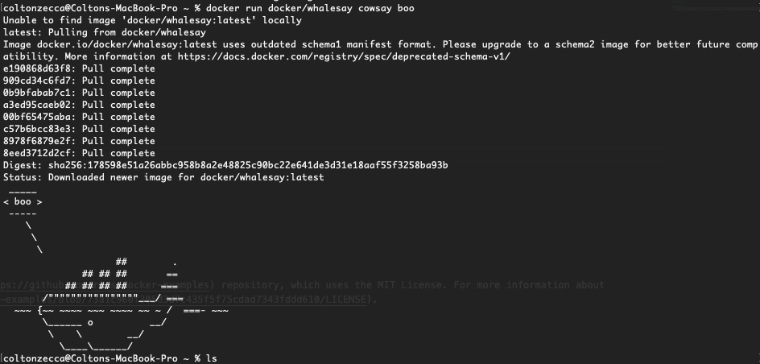

---
## Example 1: Creating Ubuntu in a Container
### Starting a Docker Container with an Interactive Ubuntu Terminal
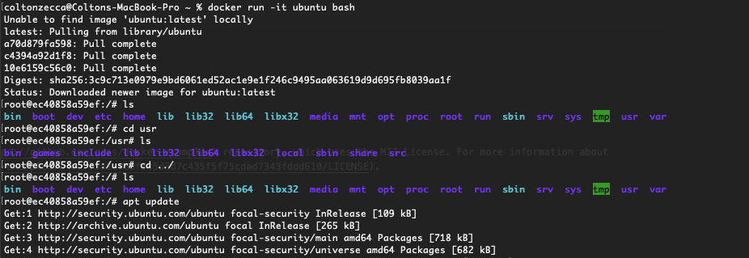

### Using VIM in the Container to Create a Text File
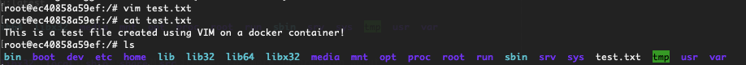

### Installing and Running `cowsay` in our Ubuntu Container
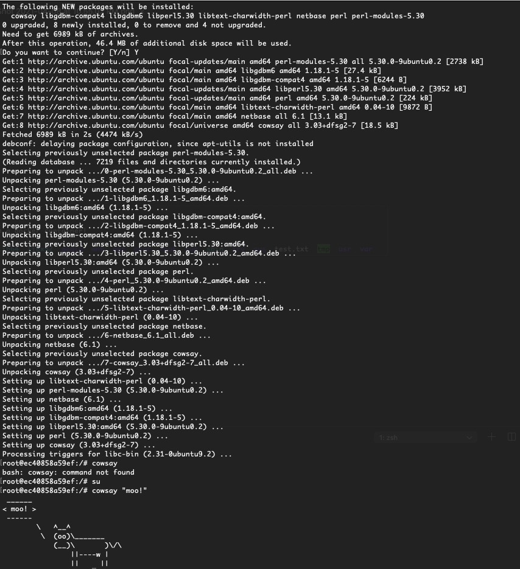

---
## Example 2: Docker in Large Projects
### Running Mongo and RocketChat, Then `docker ps` to Show Running Containers
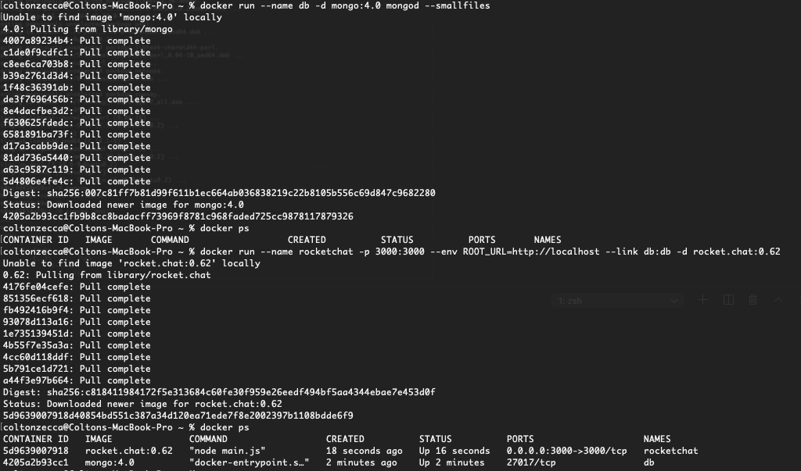

### Showing I Have RocketChat Successfully Up and Running
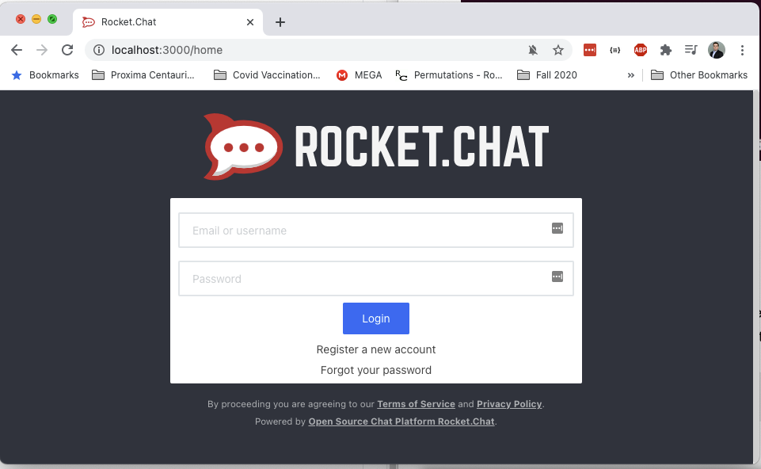

### Practicing with `docker stop`, `docker rm`, and `docker rmi`
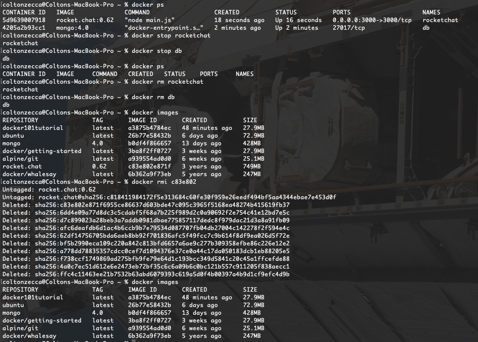

---
## Example 3: Python Hello World Server with a Dockerfile
[Link to associated Dockerfile](example03/Dockerfile)

### Building and Running the Dockerfile I Just Made
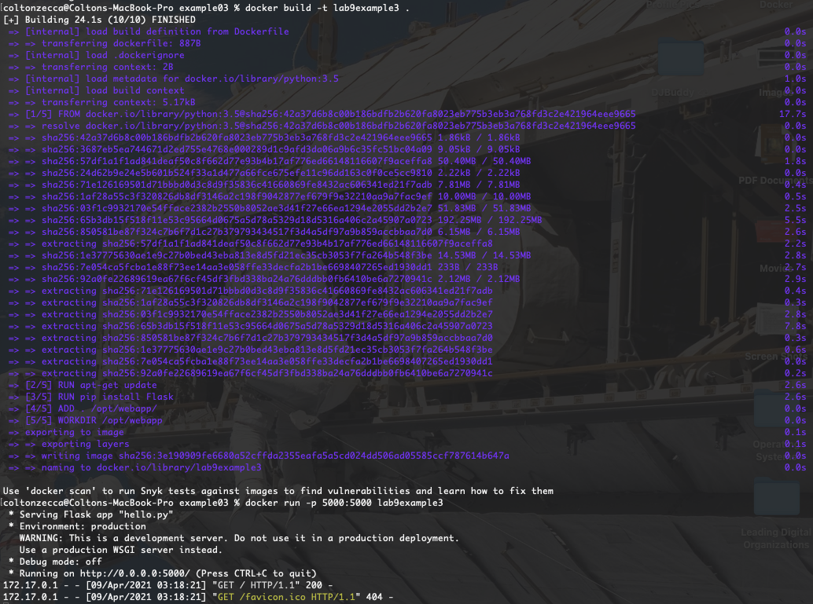

### Showing I Have the Hello World Python Server Successfully Up and Running
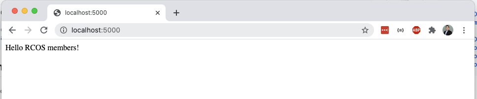

---
## Example 4: Simple Docker Compose

### Using a `Dockerfile` to Try and Set Up MessageApp
[Link to associated Dockerfile.](example04/messageApp/Dockerfile) Because we didn't set up a MongoDB database or container for our message-app to use, trying to do `docker run message-app` doesn't work. See the next part for the solution, where a `docker-compose.yml` file is used to launch a MongoDB service alongside the message-app container.

__Message-App Being Built, But Failing Upon `docker run`:__
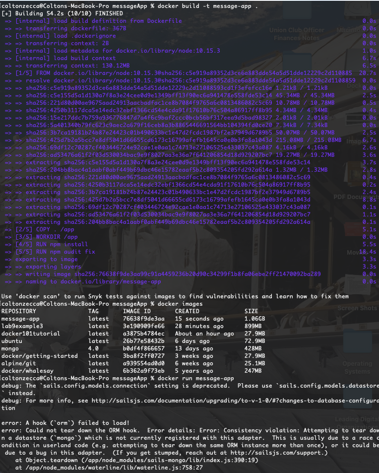

### Using `docker-compose.yml` to Launch Both MessageApp _AND_ MongoDB
[Link to associated docker-compose.yml.](example04/messageApp/docker-compose.yml) Since message-app now has an actual database to use, it successfully builds and runs. This is done by first building the images, setting up our volumes, etc. with `docker compose build` and then running the services using `docker compose up`. Note that since `docker-compose` is now bundled with `docker` as of recent updates, the hyphen in between _docker_ and _compose_ is no longer necessary.

__Playing Around With Message-App Since It's Now Working:__
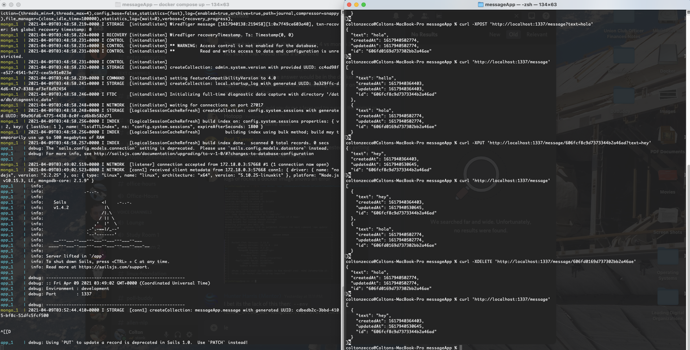

---
## Licensing
The example code used in this lab comes from the [rcos/docker-examples](https://github.com/rcos/docker-examples) repository, which uses the MIT License. For more information about licensing for the example code, click [here](https://github.com/rcos/docker-examples/blob/73a1c960f305d3d7c435f5f75cdad7343fddd610/LICENSE).